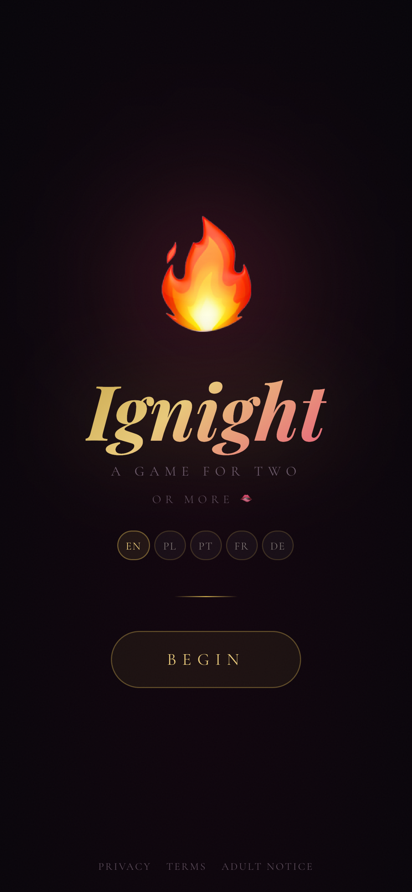
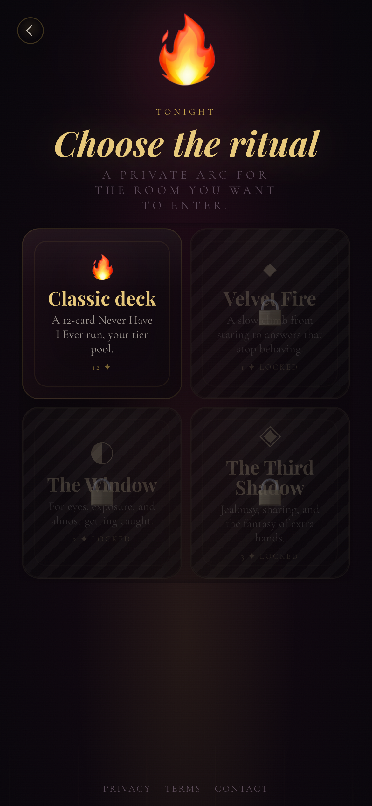
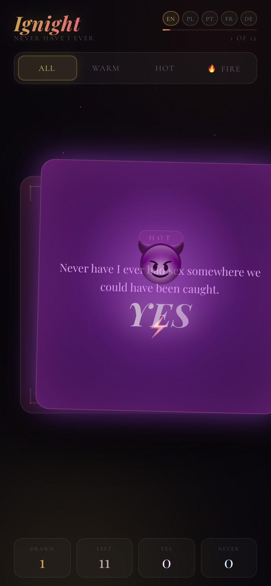
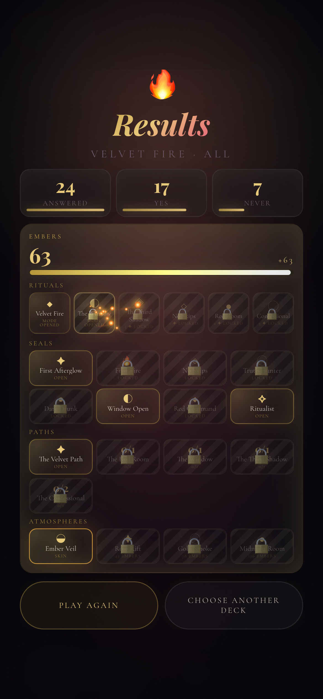

# Ignight

An adult, local-first card game for two or more people: velvet UI, explicit late-night decks, rituals, embers, unlocks, swipe-driven play, and a careful multiplayer prototype for `ignight.me`.

Ignight is built as a static web/PWA-first product. The active play space stays minimal: one card, a few decisive controls, and atmosphere that moves around the players instead of burying them in menus.

<p align="center">
  
  
  
  
</p>

## What It Is

- **Explicit adult card play** across Never Have I Ever and Truth or Dare.
- **Rituals and progression** with short session arcs, embers, seals, unlockable rituals, and deck atmospheres.
- **Five-language content**: English, Polish, Brazilian Portuguese, French, and German.
- **Hot-swappable localization** across the live UI, including active sessions and multiplayer interface copy.
- **Premium motion system**: shuffle-in card formations, contextual rift effects, swipe overlays, emoji rain moments, and a cinematic splash reveal.
- **Local-first architecture** with no accounts required for the core game.
- **Multiplayer prototype** using lightweight peer signaling and optional webcam experiments, designed to evolve without disturbing single-player play.

## Product Principles

Ignight should feel like a room changing around the players, not a dashboard demanding attention.

- Active gameplay stays sacred: card, action, swipe, atmosphere.
- Progression appears after a match, not during the moment.
- Unlocks feel private and earned, not noisy.
- The visual language is dark, warm, erotic, and polished.
- The tone is direct and confessional, with enough velvet to keep it premium.

## Project Structure

```text
Ignight/
  index.html                 App shell
  styles/                    Layout, visual system, animation styling
  scripts/                   Game logic, content loading, multiplayer, audio
  locales/                   Deck and UI localization
  docs/                      Launch notes and repo documentation
  docs/screenshots/          High-resolution README captures
  *.php                      Lightweight multiplayer/webcam support
```

## Local Run

```bash
python3 -m http.server 5181
```

Open:

```text
http://127.0.0.1:5181/
```

Static app pages run locally. Server-backed multiplayer pieces need a PHP-capable host.

## Repo Status

This repository tracks the public web/PWA codebase for Ignight. Public release decisions should stay deliberate because the flagship build is adult and explicit.

## License

Ignight is released under the MIT License.
